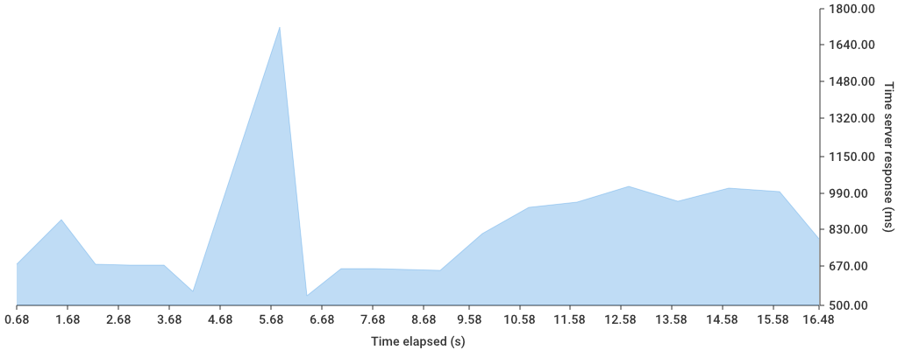

# HTTP Perf

[](https://circleci.com/gh/sauercrowd/http-perf)

Measuring performance of http endpoints.

## Usage

Currently measures for an amount of time (e.g. default 60s) or for a specific count of requests.
Creates a Graph, outputs the avg ms per request and the amount of requests made.

```
http-perf -url http://localhost:8080/
```

## Options
```
▶ http-perf -h
Usage of http-perf:
  -chartpath string
        path for chart png (default "perf.png")
  -count int
        how many times shoud be measured. If used, time flag will be ignored
  -json
        creates a json file with keys requests, timeTotalNS, timePerRequestMS, errorCount(non 200 http status), statusCounts(object, httpstatuscode as key, count as value)
  -jsonpath string
        filepath for json file (default "perf.json")
  -n int
        amount of goroutines beeing used (default 100)
  -nochart
        set if no chart should be generated
  -time int
        how many seconds should be measured. Will be ignored if amount flag is set (default 60)
  -url string
        url which should be measured
```

## Example

```
▶ http-perf -url https://github.com -n 1 -count 20 -json
2017/08/06 19:00:59 Making 20 requests with 1 goroutines
2017/08/06 19:01:15 Took 16.483824 seconds for 20 measurements
2017/08/06 19:01:15 Got 0 non-200 http status code(s)
2017/08/06 19:01:15 AVG request time: 824.169449 ms
2017/08/06 19:01:15 Creating Chart...
2017/08/06 19:01:16 Created Chart sucessfully at perf.png
```



```
▶ cat perf.json
{"requests":20,"timeTotalNS":16483824242,"timePerRequestMS":824.16944875,"errorCount":0,"statusCounts":{"200":20}}
```

